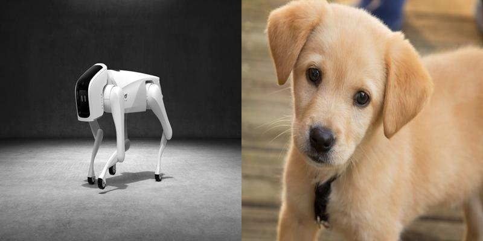

# The_best_Image_Classifier

The best Image Classifier is a machine learning model designed to effectively classify real and AI-generated images.


## Table of Contents

- [The_best_Image_Classifier](#the_best_image_classifier)
- [Table of Contents](#table-of-contents)
- [Brief Overview](#brief-overview)
- [Demo](#demo)
- [Installation](#installation)
- [Data Sources](#data-sources)
- [Data Distribution](#data-distribution)
- [Model](#model)
- [Testing and Evaluation](#testing-and-evaluation)
- [Deployment](#deployment)
## Brief Overview
[(Back to top)](#table-of-contents)

This project entailed developing a machine learning model that can accurately classify real and AI-generated images. Initially, we utilized the CIFLAKE dataset, the details of which are outlined below, and then employed Beautiful Soup to generate additional images, integrating them with the CIFLAKE dataset. The image contents can be found in test.zip and train.zip.

CIFLAKE:- This dataset comprises around 120,000 low-res images divided into 100,000 for training and 20,000 for testing. Access the dataset at: https://www.kaggle.com/datasets/birdy654/cifake-real-and-ai-generated-synthetic-images


Then we preprocessed the images, extracted their features, split the training data into training and validation sets. Next, we built and trained a Convolutional Neural Network based classifier model using a dataset of approximately 100,000 images.


## Demo 
[(Back to top)](#table-of-contents)

Here is a short demo of the deployed web application.

https://github.com/kovidjuneja/assets/blob/main/Screen%20Recording%202024-06-15%20at%208.37.47%20AM.mov
## Installation
[(Back to top)](#table-of-contents)

Open Git Bash and change the directory to the location where the repository is to be cloned. Then, type the following commands.

```shell
  git init
```
```shell
  git clone https://github.com/kovidjuneja/The_best_image_classifier
```
Now, install the requirements using the following command.

```shell
   pip install -r requirements.txt 
```
To access or use the application, open a terminal in the cloned repository folder and run the following command.

```shell
  streamlit run app.py
```
Finally, browse the link provided in your browser.


## Data Sources
[(Back to top)](#table-of-contents)

The dataset comprised of real and ai generated images.Firstly we used CIFLAKE dataset and then we used beautiful soup for extracting images from websited like dreamstime and freepik

CIFLAKE:-https://www.kaggle.com/datasets/birdy654/cifake-real-and-ai-generated-synthetic-images

Freepik:-https://www.freepik.com/

Dreamstime:-https://www.dreamstime.com/free-photos


## Data Distribution
[(Back to top)](#table-of-contents)

 Training data shape: (100766, 32, 32, 3)
 
Training labels distribution: [50398 50368]

Test data shape: (20465, 32, 32, 3)

Test labels distribution: [10235 10230]


## Model
[(Back to top)](#table-of-contents)

The model used VGG16 as the base model, followed by flattening the data, then a Dense layer of 256 units, followed by a dropout of 0.5, and finally a sigmoid activation layer.

> Model architecture and Model summary are uploaded
## Testing and Evaluation
[(Back to top)](#table-of-contents)

During evaluation, the model achieved an accuracy of 88.68%.

Classification Report and Confusion matrix have been uploaded.

Classification Report: https://github.com/kovidjuneja/The_best_image_classifier/blob/main/Classification%20Report

Confusion Matrix: https://github.com/kovidjuneja/The_best_image_classifier/blob/main/Confusion%20Matrix
> 0 represents Real and 1 represents AI Generated
## Deployment
[(Back to top)](#table-of-contents)

The application has been deployed in the Streamlit Cloud.

You can access it here: https://thebestimageclassifier-ruyudrfkfvxmtl3qrs6b8b.streamlit.app/
